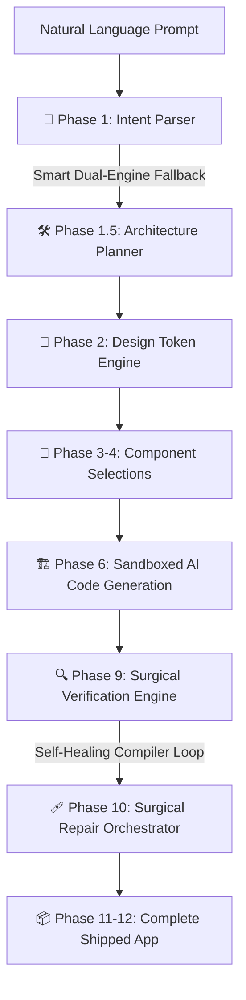

# 🌌 NOVARYX — AI-Powered Autonomous Application Builder

> **Compose production-grade web applications from a single prompt.**  
> Built with strict compiler-verification, real-time telemetry, and resilient dual-engine cognitive fallback.

[](LICENSE)
[](https://nextjs.org/)
[](https://www.python.org/)
[](https://tailwindcss.com/)
[](https://ollama.com/)

---

## ⚡ What is NOVARYX?

**NOVARYX** is a next-generation autonomous software engineer. Instead of producing isolated code snippets or buggy single-file solutions, NOVARYX orchestrates an **End-to-End Generation & Self-Healing Pipeline** that outputs fully structured, compiler-safe, and ready-to-run Next.js web applications, integrated with databases, authentication, and state management.



---

## ✨ Features

* **🚀 Intent Parsing & Sitemap Planner:** Translates unstructured natural language into structured `ProjectSpec` definitions containing pages, submodules, features, layouts, and system configurations.
* **🛡️ Smart Dual-Engine Fallback:** Zero-hang cognitive routing. If the lightning-fast cloud **Groq (llama-3.3-70b)** endpoint hits rate limits, the system instantly hot-swaps to your local **Ollama (novaryx-qwen)** without breaking the pipeline.
* **📦 Complete Sandboxed Generation:** Automatically runs compiler analysis during code generation. If a typescript or react import is broken, the **Surgical Repair Engine** patches it in a sandboxed environment before shipping.
* **🔌 PocketBase Integration:** Instantly scaffolds authentication, database collections, schemas, and API rules if requested by the user prompt.
* **💫 Cockpit UI / Visual Builder:** Dynamic Next.js developer dashboard showcasing step-by-step telemetry, orchestration phase progress (0-12), and execution logs.

---

## 🏗️ Project Architecture

```text
NOVARYX/
├── system/                    # Core compilation, healing, and reasoning engine
│   ├── inference/             # Provider implementations (Groq, Ollama, Gemini)
│   ├── intelligence/          # Cognitive parsers, validators, sitemaps, and schemas
│   ├── rag_engine/            # RAG component memory indexers and ChromaDB
│   ├── realtime/              # WebSocket telemetry and system notification servers
│   └── templates/             # Premium responsive dynamic UI blueprints
├── novaryx-web/               # Next.js 15 & Tailwind Developer Dashboard (Cockpit)
├── exports/                   # Shipped build output folder containing compiled apps
├── config/                    # Global token parameters & model environment settings
├── verify_fix.py              # Local testing & provider diagnostics script
├── novaryx_e2e.py             # Main pipeline entry CLI
└── novaryx_update.py          # Dynamic feature update CLI
```

---

## 🛠️ System Requirements & Setup

### Requirements
* **OS:** Windows (tested), macOS, or Linux
* **Python:** `3.10` to `3.12`
* **Node.js:** `18+` (LTS recommended)
* **Local Inference (Recommended):** [Ollama](https://ollama.com/) with `novaryx-qwen` (Qwen 2.5 Coder 7B) & `novaryx-deepseek` (DeepSeek Coder 7B) installed.

### Setup Instructions

1. **Clone the Repository**
   ```bash
   git clone <your-repository-url>
   cd NOVARYX
   ```

2. **Initialize Python Environment**
   ```bash
   python -m venv venv
   source venv/bin/activate  # On Windows: venv\Scripts\activate
   pip install -r requirements.txt  # Optional dependencies (dotenv, requests, groq, chromadb)
   ```

3. **Configure Environment Variables**
   Duplicate `.env.example` to `.env` and fill in your keys:
   ```bash
   cp .env.example .env
   ```
   Configure your Groq Cloud token:
   ```ini
   GROQ_API_KEY=gsk_your_key_here
   PREFER_CLOUD=true  # Hot-swaps dynamically to Ollama if cloud hits limits
   ```

4. **Launch Developer Services**
   Execute the all-in-one startup launcher:
   ```bash
   start_all_services.bat
   ```
   This bootstrapper fires up:
   * **WebSocket Real-time Telemetry Service** (port `9001`)
   * **Next.js Developer Cockpit Dashboard** (port `3000`)
   * **ChromaDB / Vector Database** (port `8000`)

---

## 💻 CLI Usage Guide

Run autonomous generations directly from the terminal with maximum configuration:

### 1. Build a brand-new application
```bash
python novaryx_e2e.py "Build a premium dark-themed dark purple SaaS analytics dashboard with interactive charts and high-end glassmorphism" --name "NovaMetrics"
```

### 2. Inject updates/features to an existing codebase
```bash
python novaryx_update.py "Add a fully functional user management table with roles, permissions and custom invite button" --project-dir "./exports/NovaMetrics"
```

### 3. Run Diagnostic Check
```bash
python verify_fix.py
```

---

## ⚡ Cognitive Provider Priority Matrix

When you run a generation, NOVARYX smart-routes each submodule to the ideal model:

| Cognitive Task | Primary Engine | Local Fallback (No Rate-Limits) | Model Purpose |
| :--- | :--- | :--- | :--- |
| **Sitemap & Intent Parsing** | Groq (`llama-3.3-70b-versatile`) | Ollama (`novaryx-qwen`) | High-speed, high-density structured JSON parsing |
| **Layout & Page Scaffold** | Ollama (`novaryx-qwen`) | Groq (`llama-3.1-8b-instant`) | Component synthesis & modular react structure |
| **Surgical Code Repair** | Ollama (`novaryx-deepseek`) | Groq (`llama-3.3-70b-versatile`) | Deep parsing of compilation tracebacks & imports |
| **Component Vector RAG** | Local (`nomic-embed-text`) | None | Local vector similarity matching |

---

## 🤝 Contributing

Contributions are what make the open-source community an amazing place to learn, inspire, and create. Any contributions you make are **greatly appreciated**.

1. Fork the Project
2. Create your Feature Branch (`git checkout -b feature/AmazingFeature`)
3. Commit your Changes (`git commit -m 'Add some AmazingFeature'`)
4. Push to the Branch (`git push origin feature/AmazingFeature`)
5. Open a Pull Request

---

*Built with absolute architectural discipline, not AI chaos.*  
**🌌 Engineered by NOVARYX Core Team.**
