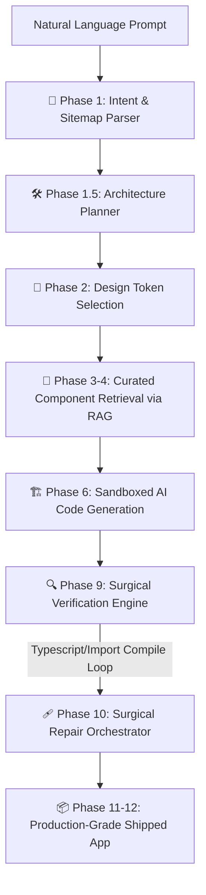

# 🌌 NOVARYX — The Next-Gen Autonomous Web Synthesis Platform

> **Compose production-grade, compiler-verified React & Next.js applications from natural language prompts.**  
> Built with strict compiler-verification, real-time WebSocket telemetry, and a hybrid local/cloud cognitive orchestrator.

[](LICENSE)
[](https://nextjs.org/)
[](https://www.python.org/)
[](https://tailwindcss.com/)
[](https://www.trychroma.com/)

---

## ⚡ The Vision & Philosophy

**NOVARYX** is not just another code-generation tool or AI snippet autocomplete. It is a fully autonomous software engineering agent designed with one fundamental goal: **to bridge the gap between creative intent and production-grade execution with absolute architectural discipline.**

Traditionally, AI-generated code is riddled with typescript errors, missing package imports, broken layouts, and inconsistent state management. NOVARYX eliminates this chaos through a **Self-Healing Web Compiler & Orchestration Pipeline**. It generates entire Next.js multi-page applications, integrates them with databases, validates their compilation, and automatically repairs any defects in a sandbox environment before final delivery.

### 🎯 The Core Mission
* **Zero-Error Guarantees:** Strict verification loops ensure every shipped project compiles without typescript, build, or syntax errors.
* **Elite Design Aesthetics:** Synthesized apps leverage curated modern UI design systems (vibrant dark modes, glassmorphism, responsive grids, and micro-interactions).
* **Hybrid Inference Independence:** Enable free, private, and unlimited offline local generations, or hook up world-class APIs like Google Gemini and Groq for blazing fast, high-density reasoning.

---

## 🏗️ The 12-Phase Synthesis & Healing Pipeline

NOVARYX runs a highly coordinated multi-phase engineering pipeline, mapping out structural layouts, selecting matching component design tokens, generating clean code, and performing compiler checks.



---

## 🌟 Advanced Engineering Highlights

### 1. ⚡ Hybrid Cognitive Engine (Free Local Mode + Cloud APIs)
Unlike platforms locked into proprietary cloud services or specific local software, NOVARYX is built around a flexible, provider-agnostic **inference framework**:
* **100% Free & Local Offline Inference:** Generate applications at zero cost and with absolute privacy using free, local offline engines.
* **Elite Cloud Scale:** Seamlessly activate commercial APIs including **Google Gemini 2.0 (Flash & Pro)**, **Groq Cloud (llama-3.3-70b)**, and others for lightning-fast multi-threaded workspace planning.
* **Dual-Engine Fallback:** A dynamic priority matrix guarantees zero-hang generation. If a cloud API hits a rate limit, the system instantly hot-swaps tasks to a local fallback engine without breaking the compilation session.

### 2. 📚 Context-Aware Vector RAG Engine
Instead of synthesizing complex frontend layouts from scratch, NOVARYX embeds a local vector database powered by **ChromaDB**. 
* **Pre-Seeded Knowledge base:** Curated with industry-standard, compiler-safe design blueprints, component layouts, state management utilities, and API wrappers.
* **Semantic Retrieval:** When you request a specific UI feature, the RAG engine searches the vector store, retrieves high-end, clean React patterns, and injects them as immediate, high-fidelity context for the generative models.

### 3. 🩹 Sandboxed Surgical Self-Healing Loop
Once the initial code is generated, the code is evaluated by an aggressive suite of **Surgical Verification Engines**:
* **Quality Gates & Checkers:** Evaluates TypeScript types, imports, build steps, dynamic package requirements, and UX patterns.
* **Surgical Repair Orchestrator:** If errors occur, the stack trace and file context are fed to an LLM-driven classification fixer which surgically rewrites the exact lines containing the error, re-validating until the build compiles successfully.

### 4. 🎛️ Next.js Developer Cockpit Dashboard
Monitor your autonomous agent in real time. The Next.js 15 developer dashboard connects directly to the backend through WebSockets, presenting:
* Interactive phase status updates.
* Live compiler stdout, build outputs, and logs.
* Project file tree visualizer.

---

## 📂 Project Architecture

```text
NOVARYX/
├── system/                    # Core compilation, healing, and reasoning engine
│   ├── inference/             # Provider implementations (Gemini, Groq, Ollama)
│   ├── intelligence/          # Cognitive parsers, validators, sitemaps, and schemas
│   ├── rag_engine/            # RAG component memory indexers & ChromaDB clients
│   ├── repair/                # Surgical bug detection, llm_repairer, and trust scoring
│   ├── verification/          # TypeScript compile tests, build check, and UX checkers
│   ├── realtime/              # WebSocket telemetry and system notification servers
│   └── templates/             # Premium responsive dynamic UI blueprints
├── novaryx-web/               # Next.js 15 & Tailwind Developer Dashboard (Cockpit UI)
├── exports/                   # Shipped build output folder containing compiled apps
├── config/                    # Global token parameters & model environment settings
├── verify_fix.py              # Local testing & provider diagnostics script
├── novaryx_e2e.py             # Main pipeline entry CLI
└── novaryx_update.py          # Dynamic feature update CLI
```

---

## 🛠️ System Requirements & Setup

### Requirements
* **OS:** Windows (tested), macOS, or Linux
* **Python:** `3.10` to `3.12`
* **Node.js:** `18+` (LTS recommended)

### Setup Instructions

1. **Clone the Repository**
   ```bash
   git clone https://github.com/bhargavatejagolla/Novaryx.git
   cd NOVARYX
   ```

2. **Initialize Python Environment**
   ```bash
   python -m venv venv
   
   # On Windows:
   venv\Scripts\activate
   # On macOS/Linux:
   source venv/bin/activate
   
   # Install dependencies
   pip install -r requirements.txt
   ```

3. **Configure Environment Variables**
   Copy the template `.env.example` file to `.env`:
   ```bash
   cp .env.example .env
   ```
   Open `.env` and configure your preferred models and keys. You can activate Gemini or Groq to tap into cloud performance, or keep it running on local free models:
   ```ini
   # To use cloud APIs:
   GEMINI_API_KEY=your_gemini_api_key_here
   GROQ_API_KEY=your_groq_api_key_here
   ```

4. **Launch Developer Services**
   Execute the all-in-one startup launcher to boot up the telemetry servers, ChromaDB vector store, and the Next.js Developer Cockpit Dashboard:
   ```bash
   start_all_services.bat
   ```
   This bootstrapper fires up:
   * **WebSocket Real-time Telemetry Service** (port `9001`)
   * **Next.js Developer Cockpit Dashboard** (port `3000`)
   * **ChromaDB / Vector Database** (port `8000`)

---

## 💻 CLI Usage Guide

Run autonomous generations directly from the terminal with maximum configuration:

### 1. Build a brand-new application
```bash
python novaryx_e2e.py "Build a premium dark-themed dark purple SaaS analytics dashboard with interactive charts and high-end glassmorphism" --name "NovaMetrics"
```

### 2. Inject updates/features to an existing codebase
```bash
python novaryx_update.py "Add a fully functional user management table with roles, permissions and custom invite button" --project-dir "./exports/NovaMetrics"
```

### 3. Run Diagnostic Check
Ensure all your providers are healthy and priorities are configured:
```bash
python verify_fix.py
```

---

## ⚡ Cognitive Provider Priority Matrix

When you run a generation, NOVARYX smart-routes each submodule to the ideal model:

| Cognitive Task | Primary Cloud Engine (Optional) | Local Fallback (Free & Offline) | Model Purpose |
| :--- | :--- | :--- | :--- |
| **Sitemap & Intent Parsing** | Groq (`llama-3.3-70b-versatile`) or Gemini (`gemini-2.0-pro`) | Local Free Model | High-speed, high-density structured JSON parsing |
| **Layout & Page Scaffold** | Gemini (`gemini-2.0-flash`) | Local Free Model | Component synthesis & modular react structure |
| **Surgical Code Repair** | Gemini (`gemini-2.0-flash`) | Local Free Model | Deep parsing of compilation tracebacks & imports |
| **Component Vector RAG** | Local (`nomic-embed-text`) | Local (`nomic-embed-text`) | Local vector similarity matching |

---

## 🤝 Contributing

Contributions are what make the open-source community an amazing place to learn, inspire, and create. Any contributions you make are **greatly appreciated**.

1. Fork the Project
2. Create your Feature Branch (`git checkout -b feature/AmazingFeature`)
3. Commit your Changes (`git commit -m 'Add some AmazingFeature'`)
4. Push to the Branch (`git push origin feature/AmazingFeature`)
5. Open a Pull Request

---

*Built with absolute architectural discipline, not AI chaos.*  
**🌌 Engineered by Golla Bhargava Teja**

